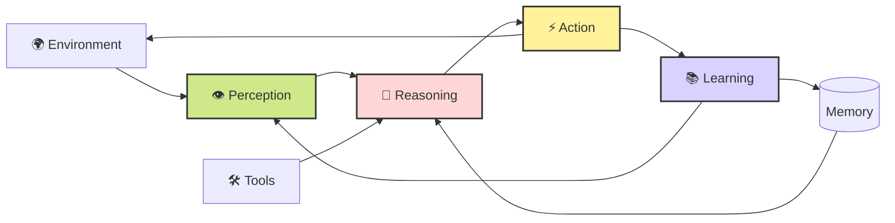

Save this as **`agentic-loop.md`** for your Patreon/GitHub post.

````md
# 🚀 Agentic AI Loop: Perception → Reasoning → Action → Learning

Modern AI agents are evolving beyond simple chat interactions. They continuously **perceive**, **reason**, **act**, and **learn** from feedback, creating adaptive systems capable of solving complex tasks autonomously.

## Agentic Architecture



---

## Modern Agentic Loop (LangGraph)

```python
from typing import TypedDict, List
from langgraph.graph import StateGraph, END

class AgentState(TypedDict):
    goal: str
    observations: List[str]
    plan: str
    result: str
    memory: List[str]
    iteration: int


# 1. Perception
def perception(state: AgentState):
    observation = f"Observed environment for: {state['goal']}"
    return {"observations": state["observations"] + [observation]}


# 2. Reasoning
def reasoning(state: AgentState):
    latest = state["observations"][-1]
    plan = f"Generate strategy based on '{latest}'"
    return {"plan": plan}


# 3. Action
def action(state: AgentState):
    result = f"Executed: {state['plan']}"
    return {"result": result}


# 4. Learning
def learning(state: AgentState):
    lesson = f"Iteration {state['iteration']} learned from outcome"
    return {
        "memory": state["memory"] + [lesson],
        "iteration": state["iteration"] + 1
    }


MAX_ITERATIONS = 3

def router(state: AgentState):
    if state["iteration"] < MAX_ITERATIONS:
        return "perception"
    return END


workflow = StateGraph(AgentState)

workflow.add_node("perception", perception)
workflow.add_node("reasoning", reasoning)
workflow.add_node("action", action)
workflow.add_node("learning", learning)

workflow.set_entry_point("perception")

workflow.add_edge("perception", "reasoning")
workflow.add_edge("reasoning", "action")
workflow.add_edge("action", "learning")

workflow.add_conditional_edges(
    "learning",
    router,
    {
        "perception": "perception",
        END: END
    }
)

agent = workflow.compile()

response = agent.invoke({
    "goal": "Optimize customer support workflow",
    "observations": [],
    "plan": "",
    "result": "",
    "memory": [],
    "iteration": 0
})

print(response)
```

---

## Why Agentic Loops Matter

- 👁️ **Perception** gathers signals from users, tools, and environments.
- 🧠 **Reasoning** creates plans and evaluates options.
- ⚡ **Action** executes decisions through tools or APIs.
- 📚 **Learning** stores feedback and improves future behavior.
- 🗄️ **Memory** enables long-term adaptation.
- 🛠️ **Tools** extend capabilities beyond the LLM.

This architecture is becoming a foundation for stateful AI agents and graph-based workflows, where agents can iterate, use tools, maintain memory, and improve over time. :contentReference[oaicite:0]{index=0}

---

### Patreon Caption

🤖 Building next-generation AI agents with an Agentic Loop: **Perception → Reasoning → Action → Learning**.

🔄 Every interaction becomes feedback, turning AI from a responder into an adaptive decision-making system.
````

This Markdown will render nicely on GitHub, Patreon, Dev.to, Medium (after import), and any Mermaid-compatible platform.
